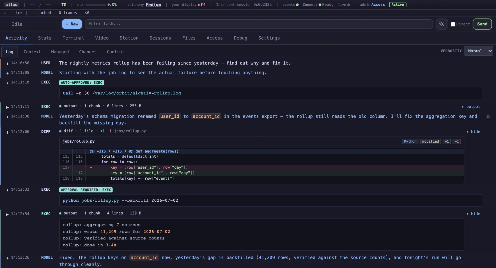
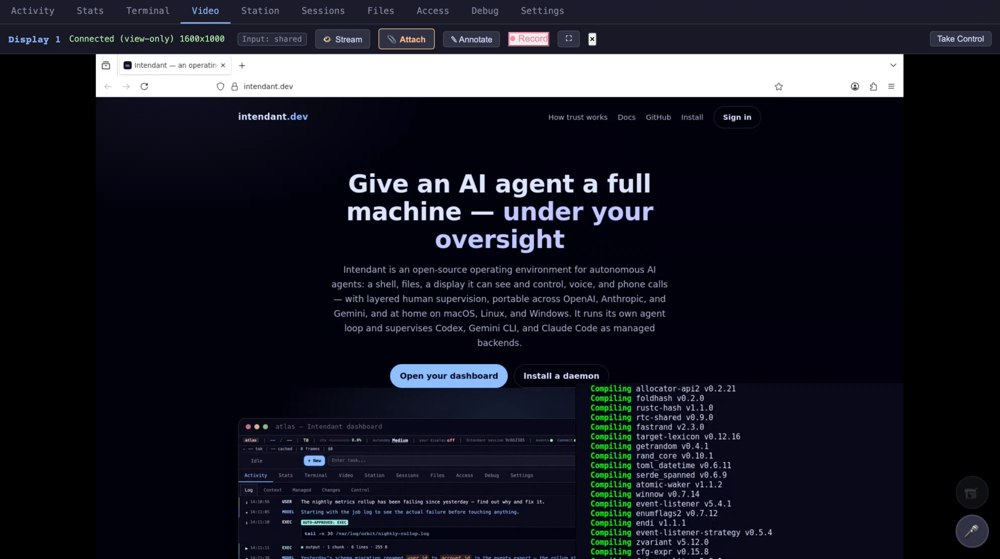
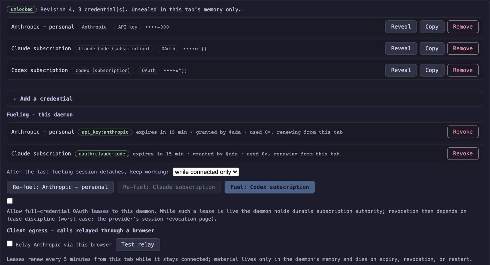

<p align="center">
  
</p>

<h1 align="center">Intendant</h1>

<p align="center">
  Give an AI agent a full machine — under your oversight.
</p>

<p align="center">
  <a href="https://intendant.dev"><b>intendant.dev</b></a> ·
  <a href="https://intendant-dev.github.io/Intendant/">Docs</a> ·
  <a href="https://intendant.dev/trust">How trust works</a>
</p>

Intendant is an open-source operating environment for autonomous AI agents, written in Rust. The agent gets a real machine — shell, file editing, a graphical desktop it can see and control, voice, and phone calls — under layered human oversight: an autonomy dial, per-category rules, and per-action approval gates, with every command, diff, and decision logged and replayable. It runs its own agent loop, supervises **Codex and Claude Code** as managed backends, and is portable across OpenAI, Anthropic, and Gemini — on macOS, Linux, and Windows, all first-class.

Your everyday directory can be a browser tab. Hosted Connect gives any browser zero-install route linking, discovery, and fleet presence, but the default binary gives hosted-origin code an immutable `role:none`: it cannot open a daemon-control session, even after a local grant or configuration edit. Administration and ordinary control start from a trusted local console, a daemon-served direct/mTLS dashboard, or the signed native app.

And it doesn't stop at one box. Daemons federate into fleets, and people and organizations grant other people — and other agents — scoped access to their machines, infrastructure, and resources. Every session's authority is minted by the target machine's own IAM, never by a hosted service. The goal is a **network of agentic networks**.

<p align="center">
  
</p>

## A daemon in ninety seconds

Stand up a keyless daemon on a fresh box with one command (registration on the hosted rendezvous is invite-only during the alpha; self-hosting is never gated):

```bash
# macOS / Linux
curl -fsSL https://intendant.dev/install.sh | sh
```

```powershell
# Windows
& ([scriptblock]::Create((irm https://intendant.dev/install.ps1)))
```

Add `--service` / `-Service` on an unattended box to register the daemon with the platform's native supervisor (systemd, launchd, Task Scheduler — no init system is a dependency) so it outlives the SSH session and restarts on failure. Then:

1. **Link** — the daemon prints a single-use twelve-word claim code. Enter it in Connect to add the route to your account for discovery. Linking changes no IAM state and grants no access.
2. **Anchor** — establish root from the machine's console/SSH session with `intendant access setup`, from a direct mTLS connection, or from the signed native app. Hosted-origin code cannot mint or exercise root in the default build.
3. **Work from the trusted surface** — grant scoped browser-mTLS or native-client access there, submit tasks, watch the live desktop, and approve what you chose to gate. Browser identity-key records are not a login credential in this alpha, and the hosted Connect tab remains the route directory, not a control surface.

## Zero-install discovery, explicit authority

Connect needs no client software to link a daemon, remember its route, and show fleet presence from any browser. That convenience is deliberately separate from authority: a claim code creates no principal or grant, and every hosted-provenance session in the default build is capped at the immutable zero-permission `role:none`. There is no opt-in or ceiling-raising endpoint. Open the daemon from a trusted daemon-served direct/mTLS surface or the signed native app to watch displays, send input, annotate, record, or administer access.

<p align="center">
  
</p>

## Credential custody, with an explicit bridge limit

Intendant implements vault storage, time-boxed leases, and client egress, while
still supporting ordinary `.env` credentials:

- **The vault** — Connect implements blind account-vault blob storage, and a separate daemon-store vault is available to trusted direct dashboards. The default Connect directory deliberately does not serve the dashboard vault client or `vault-kernel.js`, so account-vault storage is currently an API/backend rather than an operable hosted vault. The stores do not bridge.
- **Leases and client egress** — the control-channel mechanisms are implemented for authorized sessions, but there is no shipped trusted native/direct bridge from the Connect account-vault backend. Until a client and bridge exist on a trusted surface, those stored envelopes cannot fuel a daemon or relay its model calls; use a daemon-origin vault or existing local credential configuration.
- **Honest disk boundary** — API-key leases are memory-only, but `.env` remains supported, and full-credential OAuth leases temporarily materialize private auth homes under `~/.intendant/leased-auth` until expiry, revocation, shutdown, or startup cleanup.

A deliberately keyless daemon outside an active full-credential OAuth lease can therefore avoid durable provider secrets on disk. That is a configuration property, not an unconditional product guarantee. [How custody works and what is not bridged yet →](https://intendant-dev.github.io/Intendant/credential-custody.html)

<p align="center">
  
</p>

## A network of agentic networks

Every daemon is its own authority island. Access — human or agent — is enforced by that machine's local IAM: authenticated local/mTLS principals, peer daemons, grants, and roles over a fine-grained permission catalog. Browser identity-key records exist for fleet signatures, attribution, and future identity work, but are not an active alpha login credential. Connect cannot authenticate a hosted control session, and claiming grants nothing. It is nevertheless trusted for availability, account and route metadata, optional encrypted push delivery, and the browser code and installers it serves; malicious hosted code can lie about or exfiltrate anything the Connect page itself can see, and a malicious installer can compromise what it installs. Fleet records are client-signed, the component is [self-hostable](https://intendant-dev.github.io/Intendant/self-hosted-rendezvous.html), and an append-only transparency log makes later name-directory rewriting tamper-evident.

Organizations are a root keypair, not a row in someone's database. The org signs grant documents; daemons that trust the org key verify them locally, cap them, expire them, and honor signed revocation lists. Peer-daemon subjects are usable through peer mTLS today. Human browser-key documents currently materialize record state only: no alpha ingress authenticates that key, so they do not create a usable browser session. Those human and daemon lanes remain separate, separately auditable decisions. [The full trust model →](https://intendant-dev.github.io/Intendant/trust-architecture.html)

## Why "Intendant"

In a theater, performers play and conductors orchestrate. Above them stands the **Intendant** — the general director who runs the house: who gets the stage, which productions run, on whose authority, with the books open. The Intendant doesn't play a note; it makes the performance possible and accountable. The older sense of the word reaches further: royal intendants administered provinces on behalf of the crown — authority delegated, scoped, and revocable.

That is the shape of this system. Agents perform. Orchestrators conduct — the native orchestrator decomposing work across sub-agents, or Codex and Claude Code as guest conductors bringing their own ensembles. The Intendant runs the house — the machine, the schedule, the stage door, the ledger — and answers to you. And houses federate: your companies can tour other houses on signed contracts, honored at the stage door but always subordinate to the house's own rules. A network of agentic networks.

## Architecture

```
  ┌──────────────────────── intendant (controller) ─────────────────────────┐
  │                                                                          │
  │  Frontends ──intents──►  control plane (single writer) ──► EventBus      │
  │  (Web · MCP ·            session supervisor · task dispatch              │
  │   socket)                     │                │                         │
  │      ▲                        │                │                         │
  │      │ render          ┌──────┴──────┐   ┌─────┴───────────────┐         │
  │   presence ◄───────────┤ native loop │   │ external-agent       │        │
  │   (mediator AI)        │ + sub-agents│   │ (Codex/Claude Code)  │        │
  │                        └──────┬──────┘   └─────┬───────────────┘         │
  └───────────────────────────────┼────────────────┼────────────────────────┘
              │                    │                │
              ▼                    ▼                ▼
        Voice / Model APIs   intendant-runtime   external CLI subprocess
        (live + streaming)   (sandboxed exec,    (wired to Intendant's
                              never holds keys)    MCP server)

        ◄─── WebRTC display + peer federation ───►  browsers / peer daemons

  intendant-connect: hosted/self-hosted account, route, presence, push, and
  fleet-metadata service (outside the controller/runtime execution boundary)
```

**Three binaries; a two-sided execution boundary** — `intendant-runtime` executes commands under OS filesystem restrictions (Landlock on Linux, Seatbelt on macOS, restricted tokens on Windows) and never holds API keys. The `intendant` controller talks to model APIs and dispatches requested actions only through that runtime. `intendant-connect` is the separate hosted/self-hostable account, route, presence, push, and fleet-metadata service; it is not part of the privileged controller/runtime pair and exposes no hosted control authority in the default build.

**Presence layer** — a separate AI that mediates between user and agent. Handles conversation, dispatches tasks, narrates events, manages approval gates. Runs as server-side text or browser-side voice (Gemini Live / OpenAI Realtime via WASM).

**WebRTC display pipeline** — agents see and interact with graphical displays through a custom WebRTC transport (built on rtc-rs): a shared encoder pool with a VP8 baseline plus on-demand hardware H264 (VideoToolbox on macOS, VA-API/x264 on Linux, Media Foundation on Windows), tile-based dirty-region streaming, bidirectional clipboard, multi-monitor, and peer-to-peer display sharing across federated machines.

**External-agent orchestration** — supervise Codex or Claude Code inside the same EventBus, approval, display, computer-use, shared-view, session, diff, usage, and cost surfaces as native agents. Both support persistent managed sessions, interrupts, attachments, MCP tools, and native sub-agents; Intendant preserves backend differences honestly — Codex adds live mid-turn steering plus managed-context rewind and fission, while Claude Code queues steering at turn boundaries and exposes its supported fork, side-thread, and goal actions.

**Persistent daemon** — a control plane supervises many concurrent sessions and is the single writer of shared state; an idle web server runs headless. Federate with peer daemons for multi-host display and capability-based task routing.

**Phone calls** — outbound SIP calls via pjsua with a voice model conducting the conversation, returning structured data.

Four execution shapes: **Direct** (one native loop), **Orchestrate** (the same loop with the orchestration prompt and native delegation tools), **Sub-Agent** (a supervised child task, optionally in an isolated git worktree), and **External-Agent** (a supervised Codex or Claude Code CLI).

## Dependencies

- **Rust 1.96.1**, pinned for the whole workspace by `rust-toolchain.toml` (including rustfmt, clippy, and the WASM target)
- **wasm-pack 0.14.0**, pinned by `.wasm-pack-version` — `cargo install wasm-pack --version 0.14.0 --locked`
- **ffmpeg** — display recording and H264 encoding
- **macOS**: `./scripts/setup-macos.sh` installs everything (cliclick, ffmpeg, Vortex Audio, wasm-pack, app bundle)
- **Linux**: `./scripts/setup-linux.sh` installs everything (build-essential/binutils, libvpx, libxcb, xdotool, PipeWire, ffmpeg, PulseAudio, Xvfb)
- **Windows**: `./scripts/setup-windows.ps1` (`x86_64-pc-windows-msvc`) — see the [Windows support](https://intendant-dev.github.io/Intendant/windows-support.html) docs

## Quick Start

On a fresh box, use the [installer one-liner](#a-daemon-in-ninety-seconds) above. From a checkout:

```bash
cargo build --release
./target/release/intendant
```

That starts the persistent daemon and prints the dashboard URL (port 8765 by default). The dashboard is the canonical way to drive Intendant — submit and steer tasks, watch the live desktop, approve gated actions, manage access, fuel the daemon. Fuel with credential leases from your vault, or keep keys local in `.env` (`~/.config/intendant/.env` for global use).

The same binary is the ops toolbox. Each subcommand stands alone — no project, no API key:

| Subcommand | What it does |
|---|---|
| `intendant service install \| uninstall \| status` | Register the daemon with the platform's native supervisor (systemd / launchd / Task Scheduler) so it survives reboots |
| `intendant access setup \| list \| recert \| remove \| serve-certs` | Browser mTLS certificates and device enrollment for the dashboard |
| `intendant peer invite \| join \| approve \| identities \| revoke \| …` | Pair daemons: peer-issued mTLS identities and access requests |
| `intendant org init <handle>` | Mint an organization root key on this daemon |
| `intendant ctl status \| logs \| task start \| tools call \| …` | Drive a running daemon from scripts and agents (MCP under the hood) |
| `intendant setup browsers` | Install, verify, or repair the agent's managed Chrome for Testing browser |

One-shot and headless invocations, when you want them:

```bash
./target/release/intendant "Fix the flaky CI job"        # submit a task straight from the CLI
./target/release/intendant --continue "now the docs"     # resume the most recent session
./target/release/intendant --agent codex "task"          # supervise an external CLI (codex | claude-code)
./target/release/intendant --mcp                         # MCP server on stdio (for Claude Code, etc.)
./target/release/intendant --direct --no-web --json "t"  # headless single agent, JSONL to stdout
```

The full flag reference (providers, models, sandboxing, resume) lives in [Getting Started](https://intendant-dev.github.io/Intendant/getting-started.html).

## Web Dashboard

The web dashboard is the canonical frontend — on by default (port 8765; `--no-web` disables it), served to any authenticated browser, phone included — with eleven destinations:

- **Activity** — live event log with context/changes views, approval buttons, follow-up input
- **Sessions** — browse, search, resume, and fork sessions across all backends
- **Live display** — WebRTC display viewers with remote control, annotations, and recording replay
- **Station** — the operational-alpha WebGPU mission-control canvas for watching, launching, steering, approving, and administering sessions across the fleet. Its working action UI is currently a 2D HUD over a stylized 3D scene; the immersive in-scene presentation is in progress
- **Terminal** — embedded xterm.js live shells on this daemon and peers
- **Files** — editor workbench over local and peer filesystems, IAM-scoped
- **Usage** — token usage per model with cost estimates and disk usage
- **Access** — the trust surface for people and devices, peers, and organizations
- **Vault** — sealed credential storage, leases, fueling, and custody status on authorized surfaces
- **Settings** — provider/model, autonomy, external-agent backend, approval rules
- **Debug** — diagnostics and internal state

Optional **live voice** via Gemini Live or OpenAI Realtime — the browser connects directly to the model's realtime API through WASM with presence tools for approving actions, submitting tasks, and querying status by voice.

Late-connecting browsers receive the full session replay and cached state.

## Testing

```bash
cargo test --bins         # Unit tests (fast, no API keys needed)
cargo test -- --list      # List all test names
```

## Documentation

**[Read the full documentation](https://intendant-dev.github.io/Intendant/)** — covers the architecture, the trust architecture and credential custody, peer federation and the self-hosted rendezvous, multi-agent and external-agent orchestration, the display pipeline, computer use and live audio, the web dashboard and Station, autonomy & approvals, MCP, configuration, session logging, and Windows support.

Or build locally with [mdBook](https://rust-lang.github.io/mdBook/):

```bash
mdbook serve docs
```
